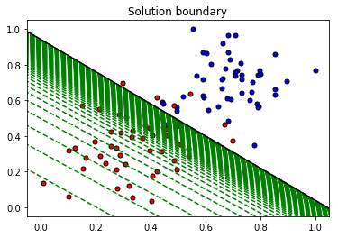
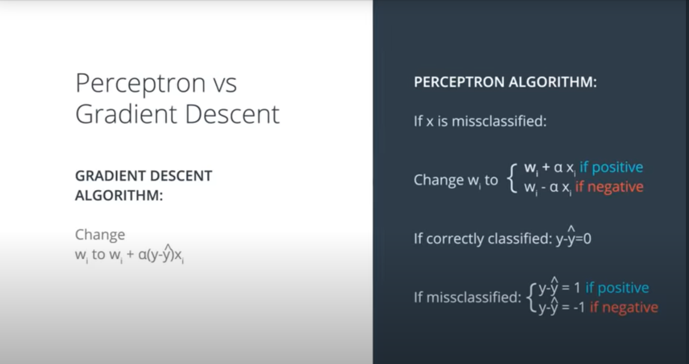
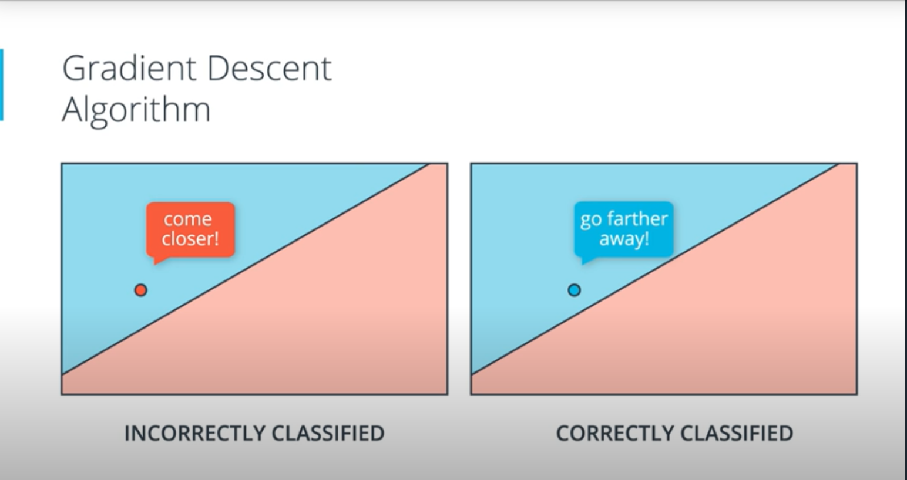

# Deep-learning

### Neural Network Architecture

Single perceptron or Logistic regression will work best only on linearly separable data. This is were Neural network come into picture, to build a model that can learn from non linear data we can combine two or multiple perceptrons and  output of this can be passed to sigmoid funtion to get the probabilites 

